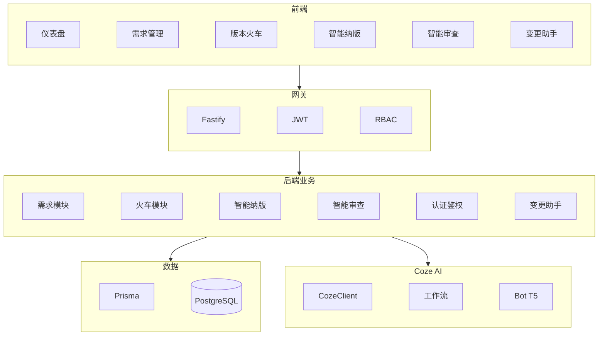
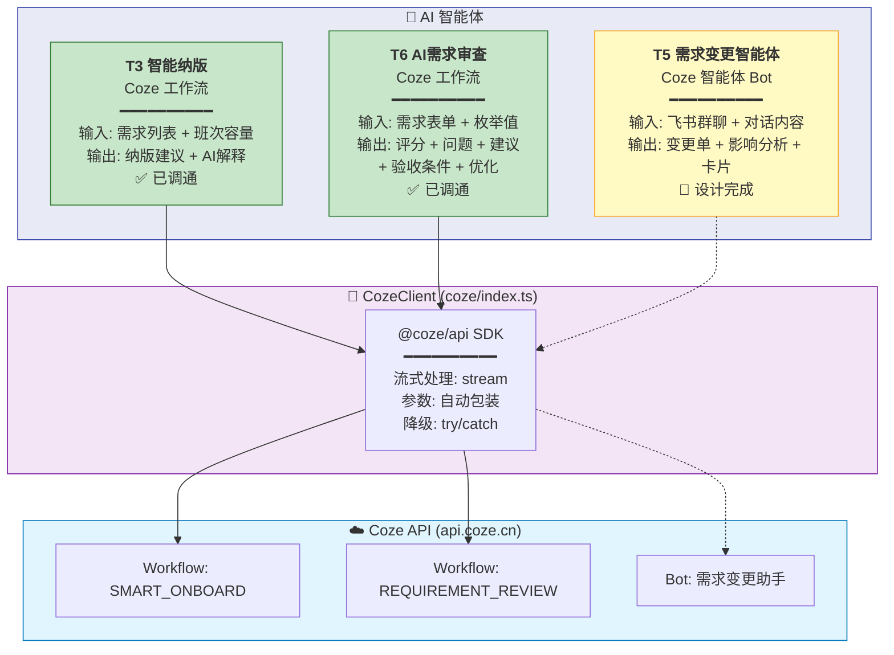
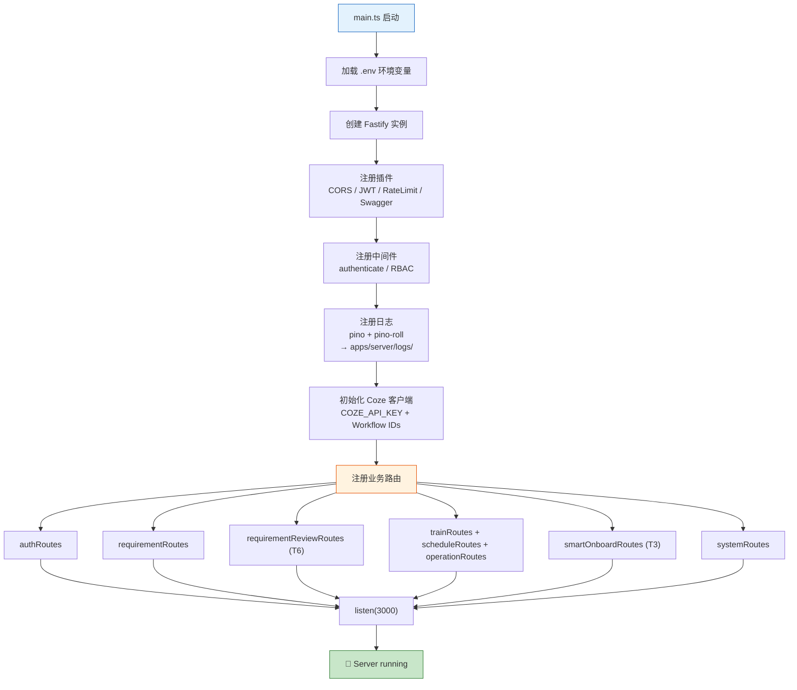
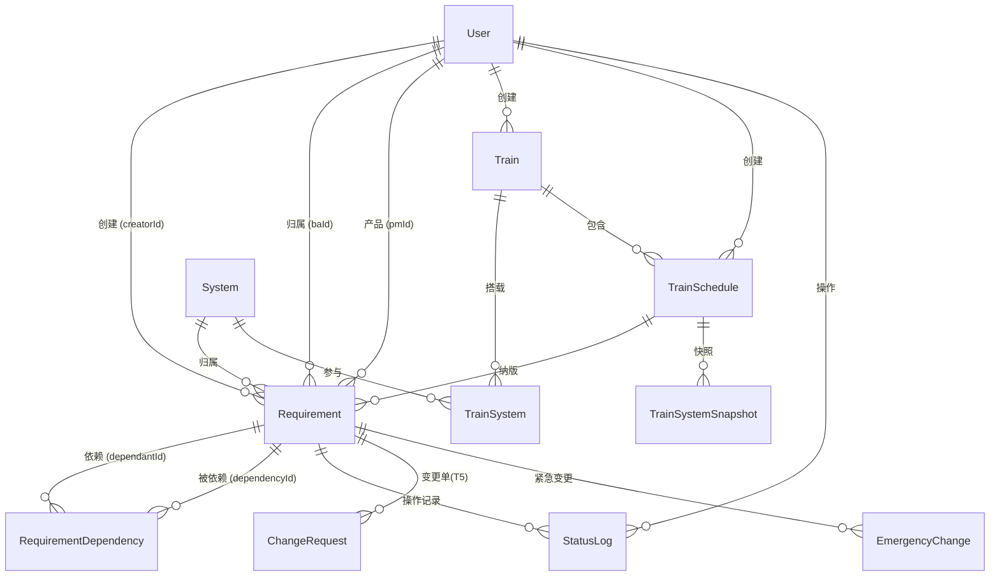

# 系统总体架构与技术实现地图

**版本号**: v2.1
**日期**: 2026-05-29
**对应 Issue**: ISSUE-005
**代码基线**: `main` 最新代码
**变更**: v2.1 — 架构图改为 graph LR 横向布局（简化 Coze 回流、合并数据层）

---

## 一、文档目标

本文档说明 `release-train` 工程的总体技术架构、模块边界、代码组织和需求到实现的映射关系。后续 AI 或开发者应优先使用本文档定位代码，而不是从全仓库无序搜索。

## 二、系统架构图



### 分层说明

| 层级 | 技术 | 说明 |
|------|------|------|
| **用户界面层** | React + Ant Design + Zustand | 5 个核心页面模块，通过 Axios 调用后端 |
| **API 网关层** | Fastify | 统一入口，提供 CORS/JWT/RBAC/Swagger |
| **业务逻辑层** | TypeScript 模块 | 5 个业务模块，按领域拆分 |
| **数据访问层** | Prisma ORM | 类型安全数据库操作，8 个核心模型 |
| **数据存储层** | PostgreSQL 16 | 本地开发 localhost:5432 |
| **Coze AI 平台** | Coze 工作流/智能体 | 3 个 AI 能力，独立部署在 api.coze.cn |
| **Coze 集成层** | @coze/api SDK | 统一封装流式处理、参数包装、降级策略 |

## 三、AI 智能体流水线架构

### 3.1 Coze 平台选型理由

| 维度 | Coze 平台 | 自建 LLM (DeepSeek) | 选型结论 |
|------|----------|---------------------|---------|
| **开发效率** | 可视化工作流编排，拖拽式节点配置 | 需手写 Prompt chaining + API 集成 | ✅ Coze |
| **流式响应** | SDK 原生支持 SSE stream | 需自行实现 SSE | ✅ Coze |
| **调试体验** | 内置 debug_url，可回放查看每步输入输出 | 需自行构建日志 | ✅ Coze |
| **插件生态** | 支持自定义 API 插件 + 飞书渠道 | 需自行对接飞书 API | ✅ Coze |
| **运维成本** | 零运维，Coze 托管 | 需自己部署和维护服务 | ✅ Coze |
| **知识库** | 内置 RAG 知识库 | 需自行集成向量数据库 | ✅ Coze |
| **成本** | 按调用计费，MVP 阶段免费额度充足 | Token 按量付费 | → Coze |
| **数据安全** | 国内 API 节点 (api.coze.cn) | 可控 | ✅ Coze |

### 3.2 智能体流水线概览



### 3.3 Coze SDK 集成模式

```typescript
// coze/index.ts — 统一封装
class CozeClient {
  // 流式调用工作流
  async runWorkflow(workflow: CozeWorkflow, parameters: any) {
    // SDK 自动将 parameters 包装为 { parameters: {...} }
    // 注意: 不要手动双重嵌套 { parameters: { parameters: {...} } }
    const res = await this.apiClient.workflows.runs.stream({
      workflow_id: this.getWorkflowId(workflow),
      parameters: parameters,  // ← 直接传参，SDK 自动包装
    });

    // 流式事件处理
    for await (const part of res) {
      if (part.event === 'PING')     → 心跳，忽略
      if (part.event === 'Message')  → 解析 content JSON → 提取 output
      if (part.event === 'Done')     → 工作流结束
      if (part.event === 'Error')    → 抛出异常(含 debug_url)
    }
  }
}
```

### 3.4 智能体设计模式对比

| 模式 | T3 智能纳版 | T6 AI审查 | T5 变更智能体(规划) |
|------|-----------|----------|-------------------|
| **Coze 类型** | 工作流 | 工作流 | 智能体(Bot) |
| **触发方式** | 前端 HTTP POST | 前端 HTTP POST | 飞书群聊 @ |
| **输入解析** | 后端组装 JSON | 后端组装 JSON | LLM 从对话提取 |
| **插件调用** | 无 | 无 | 4个 /api/plugin/* |
| **输出方式** | 流式 JSON → 前端 | 流式 JSON → 前端 Modal | Markdown + 飞书交互卡片 |
| **降级策略** | 规则引擎兜底 | 本地7项规则兜底 | 人工确认兜底 |
| **异步处理** | 同步等待 | 同步等待(60-110s) | 异步(卡片回调) |
| **超时配置** | 默认 | axios 180s | Coze 平台超时 |

## 四、完整项目文件结构

```
版本火车/                                    # 项目根目录
├── AGENTS.md                               # AI 协作入口：规则索引 + 代码映射引用
├── .gitignore
│
├── 01-rules/                               # 规则与规范文档
│   └── 规则文档/
│       ├── AI协作规范.md                    # 项目启动/需求确认/设计/编码/文档管理
│       ├── coding-standards.md             # 统一编码规范（类型/分层/命名/接口）
│       ├── RT-安全规范_20260510.md          # 安全规范（密钥/鉴权/校验/脱敏）
│       └── 版本火车需求管理系统_项目实现规划_20260509.md
│
├── 02-项目管理与跟踪/                       # 项目管理工作记录
│   ├── 工作小结/                            # 每日工作小结（Day 1~17）
│   ├── handoff/                            # Agent 交接文档
│   ├── 待办事项.md                          # 待办清单（含已完成记录）
│   └── 版本火车需求管理系统_项目实现规划_20260509.md
│
├── 03-需求与设计/                           # 需求文档与设计产物
│   ├── 共享/
│   │   ├── CONTEXT.md                      # 领域术语 + 关系 + 歧义澄清
│   │   └── RT-代码结构映射.md               # US → 代码文件映射表
│   ├── Task0-基础框架/
│   ├── Task1-需求池管理/
│   │   ├── PRD/
│   │   ├── US详细设计/                      # US1.1~US1.10 详细设计
│   │   ├── 用户故事/                        # spec + tasks + checklist
│   │   └── 测试案例/
│   ├── Task2-版本火车管理/
│   │   ├── PRD/
│   │   ├── US详细设计/                      # US2.1~US2.9 详细设计
│   │   ├── 用户故事/
│   │   └── 测试案例/
│   ├── Task3-AI调度与日历/
│   │   ├── PRD/
│   │   ├── 设计方案/                        # 智能纳版方案 + Coze配置
│   │   └── 测试案例/
│   ├── Task4-仪表盘重构/
│   │   ├── 设计方案/
│   │   └── 测试案例/
│   ├── Task5-需求变更智能体/                # 🔶 设计完成，编码待进行
│   │   ├── 设计方案/
│   │   │   ├── RT-T5-需求变更智能体-设计方案_v1.0.md
│   │   │   └── RT-T5-需求变更智能体-分步设计_v1.0.md
│   │   ├── 用户故事/
│   │   │   ├── us5.1-change-request-api/spec.md
│   │   │   ├── us5.2-change-request-display/spec.md
│   │   │   ├── us5.3-coze-plugin-api/spec.md
│   │   │   ├── us5.4-coze-agent-workflow/spec.md
│   │   │   └── us5.5-feishu-publish/spec.md
│   │   ├── CoZe配置流程指南.md
│   │   └── 飞书CoZe需求变更智能体集成方案.md
│   └── Task6-需求审查/                      # ✅ 已完成
│       ├── PRD/
│       │   └── RT-Task6-需求审查-PRD_v1.0_20260529.md
│       ├── 设计方案/
│       │   └── RT-Task6-需求审查-设计方案_v1.0_20260529.md
│       ├── 测试案例/
│       │   └── RT-Task6-需求审查-测试案例_v1.0_20260529.md
│       ├── 用户故事/
│       │   ├── us6.1-ai-review/spec.md
│       │   └── us6.2-review-display/spec.md
│       └── CoZe需求审查智能体配置指南.md
│
├── 04-工程文档/                             # 竞赛交付工程文档
│   ├── 01-竞赛总览/
│   ├── 02-研发过程/
│   ├── 03-业务基线/
│   ├── 04-领域模型/
│   ├── 05-系统架构/                          # ← 本文档
│   ├── 06-数据模型/
│   ├── 07-AI纳版/
│   ├── 08-安全质量/
│   └── 09-部署演示/
│
├── 05-验收交付物/                           # 验收相关文档
│
├── 06-项目调研/                             # 前期调研资料
│
├── 07-归档备份/                             # 历史版本归档
│
└── release-train/                           # Monorepo 代码仓库
    ├── 项目文件结构.md                       # 代码目录树
    ├── package.json                         # 根 package.json
    ├── pnpm-workspace.yaml                  # pnpm workspace
    ├── docker-compose.yml
    ├── .env                                 # 环境变量
    ├── log/                                 # (已废弃，统一到 apps/server/logs/)
    │
    ├── apps/
    │   ├── server/                          # 后端 Fastify + Prisma
    │   │   ├── prisma/
    │   │   │   ├── schema.prisma            # 数据模型定义
    │   │   │   ├── seed.ts                  # 种子数据
    │   │   │   └── migrations/             # 数据库迁移
    │   │   ├── scripts/                     # 测试/工具脚本
    │   │   │   ├── seed-onboard-data.mjs    # 生成纳版测试数据
    │   │   │   ├── test-coze-direct.mjs     # Coze 工作流直连测试
    │   │   │   ├── delete-train-data.mjs    # 清空火车数据
    │   │   │   └── ...                      # 其他工具脚本
    │   │   ├── logs/                        # 应用日志（pino-roll + tee）
    │   │   ├── src/
    │   │   │   ├── main.ts                  # 入口
    │   │   │   ├── app.ts                   # Fastify 配置 + Coze 初始化
    │   │   │   ├── common/
    │   │   │   │   ├── coze/index.ts        # Coze SDK 封装（流式处理）
    │   │   │   │   ├── errors/              # 业务错误码
    │   │   │   │   ├── logger/              # 日志封装
    │   │   │   │   ├── middleware/          # JWT + RBAC
    │   │   │   │   └── token-blacklist/     # Token 黑名单
    │   │   │   ├── modules/
    │   │   │   │   ├── auth/                # 认证模块
    │   │   │   │   ├── requirements/        # 需求 CRUD + 状态流转
    │   │   │   │   ├── requirement-review/  # AI 需求审查 (T6)
    │   │   │   │   ├── smart-onboard/       # 智能纳版 (T3)
    │   │   │   │   ├── systems/             # 系统管理
    │   │   │   │   └── trains/              # 火车/班次/纳版/投产/回滚
    │   │   │   └── prisma/                  # Prisma 客户端
    │   │   ├── tsconfig.json
    │   │   └── vitest.config.ts
    │   │
    │   └── web/                             # 前端 React + Vite + Ant Design
    │       ├── src/
    │       │   ├── App.tsx                   # 路由入口
    │       │   ├── components/
    │       │   │   ├── AuthGuard.tsx         # 路由守卫
    │       │   │   ├── requirements/
    │       │   │   │   └── RequirementForm.tsx # 需求表单 + AI审查Modal
    │       │   │   ├── trains/               # 火车表单/系统配置
    │       │   │   ├── schedules/            # 班次日历
    │       │   │   ├── smart-onboard/        # 智能纳版 UI
    │       │   │   └── dashboard/            # 仪表盘/月历
    │       │   ├── pages/                    # 页面级组件
    │       │   │   ├── login/ dashboard/ requirements/
    │       │   │   ├── trains/ systems/ schedules/ calendar/
    │       │   ├── services/                 # API 调用层
    │       │   │   ├── api.ts                # Axios 实例 (timeout: 180s)
    │       │   │   ├── requirement.ts        # 需求 + 审查 API
    │       │   │   ├── train.ts system.ts smart-onboard.ts
    │       │   ├── stores/                   # Zustand 状态
    │       │   └── hooks/                    # 自定义 Hooks
    │       ├── index.html
    │       └── vite.config.ts
    │
    └── packages/
        └── shared/                           # 前后端共享类型
            └── src/
                ├── types/
                │   ├── requirement.ts        # 需求类型
                │   ├── review.ts             # 审查结果类型 (T6)
                │   ├── train.ts              # 火车类型
                │   ├── smart-onboard.ts      # 纳版类型
                │   └── dashboard.ts          # 仪表盘类型
                └── constants/
                    ├── index.ts              # 枚举/状态/角色/权限矩阵
                    └── error-codes.ts        # 业务错误码
```

## 五、技术栈

| 层级 | 技术 | 版本 | 说明 |
|------|------|------|------|
| 前端框架 | React + TypeScript | 18.x | SPA 应用 |
| UI组件库 | Ant Design | 5.x | 企业级中后台组件 |
| 状态管理 | Zustand | 4.x | 轻量级全局状态 |
| 构建工具 | Vite | 5.x | 快速 HMR |
| HTTP 客户端 | Axios | 1.x | 请求/响应拦截 + 超时 180s |
| 后端框架 | Fastify + TypeScript | 4.x | 高性能 Node.js 框架 |
| ORM | Prisma | 5.x | 类型安全数据库操作 |
| 数据库 | PostgreSQL | 16 | 关系型数据库 |
| 鉴权 | JWT (fastify-jwt) | — | Bearer Token |
| 日志 | pino + pino-roll | — | 结构化日志 + 按天轮转 |
| 测试 | Vitest + Supertest + Testing Library | — | 前后端单元/集成测试 |
| AI能力 | Coze API (@coze/api SDK) | — | 工作流/智能体 + 流式响应 |
| 包管理 | pnpm (workspace) | ≥8 | Monorepo 包管理 |
| 代码规范 | ESLint + TypeScript strict | — | 静态检查 |

## 六、后端架构

### 6.1 应用启动流程



### 6.2 后端模块

| 模块 | 路径 | 职责 | Task |
|------|------|------|------|
| auth | `modules/auth` | 登录、当前用户、开发 seed | T0 |
| systems | `modules/systems` | 系统列表、系统成员查询 | T0 |
| requirements | `modules/requirements` | 需求 CRUD、评审、变更、统计、待办 | T1 |
| trains | `modules/trains` | 火车、班次、容量、纳版、投产、回滚 | T2 |
| smart-onboard | `modules/smart-onboard` | AI 智能纳版建议与确认 | T3 |
| requirement-review | `modules/requirement-review` | AI需求审查（本地规则 + Coze） | T6 |
| common/coze | `common/coze` | Coze SDK 封装（工作流/流式处理） | T3/T6 |
| common/middleware | `common/middleware` | JWT 鉴权、RBAC | T0 |
| common/errors | `common/errors` | 统一错误处理 | T0 |
| common/logger | `common/logger` | 日志、脱敏、指标 | T0 |
| common/token-blacklist | `common/token-blacklist` | JWT 黑名单（登出失效） | T0 |

## 七、前端架构

### 7.1 路由表

| 路由 | 页面文件 | 说明 | Task |
|------|---------|------|------|
| `/login` | `pages/login` | 登录页 | T0 |
| `/dashboard` | `pages/dashboard` | 统一仪表盘 | T4 |
| `/requirements` | `pages/requirements` | 需求列表 | T1 |
| `/requirements/new` | `pages/requirements/create.tsx` | 新建需求（含 AI审查） | T1/T6 |
| `/requirements/:id` | `pages/requirements/detail.tsx` | 需求详情 | T1 |
| `/requirements/:id/edit` | `pages/requirements/edit.tsx` | 编辑需求（含 AI审查） | T1/T6 |
| `/trains` | `pages/trains/index.tsx` | 火车列表 | T2 |
| `/trains/new` | `pages/trains/create.tsx` | 创建火车 | T2 |
| `/trains/:id` | `pages/trains/[id].tsx` | 火车详情 | T2 |
| `/trains/:id/edit` | `pages/trains/[id]/edit.tsx` | 编辑火车 | T2 |
| `/schedules` | `pages/trains/schedules/index.tsx` | 班次列表 | T2 |
| `/trains/:trainId/schedules/:scheduleId` | `pages/trains/schedule-detail.tsx` | 班次详情 | T2 |
| `/systems` | `pages/systems` | 系统管理 | T0 |
| `/calendar` | `pages/calendar` | 日历页 | T4 |

### 7.2 前端组件

| 组件 | 路径 | 说明 |
|------|------|------|
| AuthGuard | `components/AuthGuard.tsx` | 路由守卫，检查登录状态 |
| RequirementForm | `components/requirements/RequirementForm.tsx` | 需求表单 + AI审查 Modal |
| TrainForm | `components/trains/TrainForm.tsx` | 火车创建/编辑表单 |
| TrainSystemList | `components/trains/TrainSystemList.tsx` | 搭载系统人员配置 |
| ScheduleCalendar | `components/schedules/ScheduleCalendar.tsx` | 单班次月历视图 |
| CalendarView | `components/dashboard/CalendarView.tsx` | 双月历视图（仪表盘） |
| SmartOnboardSuggestion | `components/smart-onboard/` | 智能纳版建议面板 |

## 八、共享包职责

`packages/shared` 是前后端领域契约中心：

| 文件 | 职责 | Task |
|------|------|------|
| `constants/index.ts` | 角色、状态、权限矩阵、显示标签 | T0~T4 |
| `constants/error-codes.ts` | 错误码注册表 | T0 |
| `types/api.ts` | 通用 API 响应和分页类型 | T0 |
| `types/auth.ts` | 登录、用户安全视图 | T0 |
| `types/requirement.ts` | 需求 DTO 和列表详情类型 | T1 |
| `types/review.ts` | 审查结果类型 (ReviewIssue/ReviewResult) | T6 |
| `types/train.ts` | 火车、班次、纳版相关类型 | T2 |
| `types/smart-onboard.ts` | 智能纳版输入输出 | T3 |
| `types/dashboard.ts` | 仪表盘聚合数据 | T4 |

## 九、数据模型核心关系



## 十、需求到实现地图

| 业务能力 | 后端 | 前端 | 测试 | Task |
|----------|------|------|------|------|
| 登录与鉴权 | `modules/auth`、`common/middleware` | `stores/auth.ts`、`AuthGuard.tsx` | `t0-framework.test.ts` | T0 |
| 需求录入 | `service.ts:createRequirement` | `RequirementForm.tsx` | `t1-us1-requirement-entry.test.ts` | T1 |
| 需求列表筛选 | `service.ts:listRequirements` | `pages/requirements/index.tsx` | `t1-us1.3*.test.tsx` | T1 |
| 需求详情 | `service.ts:getRequirementById` | `pages/requirements/detail.tsx` | `t1-us1.4*.test.ts` | T1 |
| 需求变更 | `service.ts:changeRequirement` | 需求列表/详情操作 | `t1-us1.11*.test.ts` | T1 |
| 火车 CRUD | `trains/services/train.service.ts` | `pages/trains`、`TrainForm.tsx` | `t2-us2.1*.test.ts` | T2 |
| 班次管理 | `routes/schedule.ts` | `schedule-detail.tsx` | `t2-us2.2*.test.ts` | T2 |
| 纳版/移除/投产/回滚 | `routes/operations.ts` | `schedule-detail.tsx` | 后端相关测试 | T2 |
| 智能纳版 | `modules/smart-onboard` | `SmartOnboardSuggestion.tsx` | Task3 测试案例 | T3 |
| AI需求审查 | `modules/requirement-review` | `RequirementForm.tsx` (Modal) | 🔶 待补充 | T6 |
| 仪表盘 | `getRequirementStats`、`getMyTodos` | `pages/dashboard` | 待补充 | T4 |
| 变更智能体 | 🔶 待编码 | 🔶 待编码 | — | T5 |

## 十一、运行时集成链路

### 11.1 需求创建链路

```text
RequirementForm
  → services/requirement.ts
  → POST /api/requirements
  → requirementRoutes
  → createRequirement()
  → Prisma Requirement / StatusLog
```

### 11.2 AI需求审查链路

```text
RequirementForm (AI审查按钮)
  → handleAIReview() 校验必填项
  → setReviewLoading(true) + showReviewModal
  → services/requirement.ts:reviewData()
  → POST /api/requirements/review (timeout: 180s)
  → requirement-review/index.ts (鉴权 + RBAC)
  → reviewRequirementData()
    ├── runLocalReview()          7项本地规则（同步）
    └── runAiReview()             Coze 工作流（异步 60-110s）
        ├── mapPriorityToChinese()   枚举→中文
        ├── mapReqTypeToChinese()
        ├── mapSourceChannelToChinese()
        └── coze.runWorkflow(REQUIREMENT_REVIEW, {...})
            ├── 成功 → issues/suggestions/score
            │          + optimizedTitle/Description/acceptanceCriteria
            └── 失败 → 降级，返回空，不阻塞
  → 合并结果: localScore×70% + aiScore×30%
  → HTTP 200 → ApiResponse<RequirementReviewResult>
  → setReviewResult() → Modal Tabs 展示
```

### 11.3 班次纳版链路

```text
schedule-detail.tsx
  → services/train.ts
  → POST /api/trains/schedules/:scheduleId/onboard
  → operationsRoutes
  → onboardRequirements()
  → Requirement.status = ONBOARDED
  → TrainSystemSnapshot.usedPoints 更新
  → StatusLog 写入
```

### 11.4 智能纳版链路

```text
SmartOnboardSuggestion
  → services/smart-onboard.ts
  → POST /api/smart-onboard/suggest
  → generateOnboardSuggestions()
    ├── getScheduleCapacity()     班次容量
    ├── getRequirementsForAI()    需求列表
    ├── detectCycleDependencies() 循环依赖检测
    └── coze.runWorkflow(SMART_ONBOARD, {...})
        ├── trainSchedule: { name, systems }
        └── selectedRequirements: [...]
  → 合并 AI结果 + 后端容量计算
  → 前端展示建议
```

## 十二、当前工程注意事项

- 项目根要求 Node >= 18、pnpm >= 8。
- 日志统一输出到 `apps/server/logs/`（pino-roll 按天轮转 + tee 实时双写）。
- Coze SDK 参数不要双重嵌套：SDK 已自动包装 `{ parameters: {...} }`，代码直接传参即可。
- 前端 AI 审查超时已配置为 180s（Coze 实际响应 60-110s）。
- 测试脚本统一放在 `apps/server/scripts/` 目录。
- `package-lock.json` 和 `pnpm-lock.yaml` 同时存在，以 pnpm workspace 为准。

## 十三、版本记录

| 版本 | 日期 | 变更内容 |
|------|------|----------|
| v1.0 | 2026-05-28 | 初始版本，整理系统架构、模块边界和实现地图 |
| v2.0 | 2026-05-29 | 补充系统架构图、AI智能体流水线/Coze选型、项目完整文件结构、T5/T6模块、数据模型关系图、后端启动流程、前端路由组件清单 |
