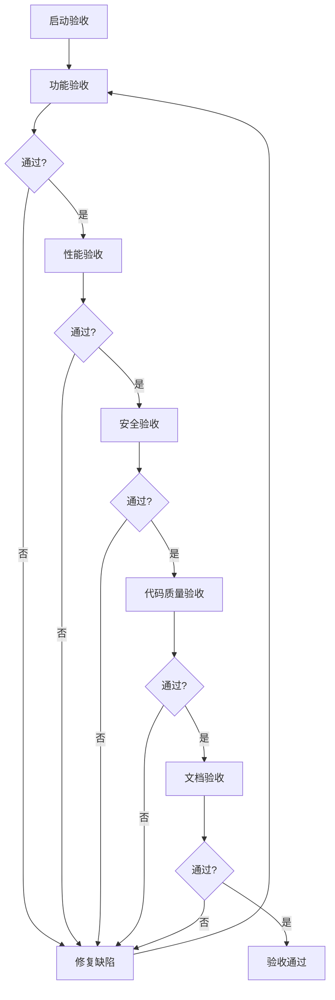

# 版本火车需求管理系统 - 验收标准

## 一、文档信息

| 属性 | 内容 |
|------|------|
| 文档编号 | RT-001 |
| 文档名称 | 验收标准 |
| 版本 | v1.0 |
| 创建日期 | 2026-05-28 |
| 项目名称 | 版本火车需求管理系统 MVP |

---

## 二、验收条目

### 2.1 功能验收

| 序号 | 验收项 | 通过条件 | 判定方法 | 关联文档 |
|------|--------|----------|----------|----------|
| F01 | 需求录入与管理 | 支持新增、编辑、删除、查询需求 | 功能测试 | RT-008 |
| F02 | 版本火车管理 | 支持版本火车的创建、编辑、状态流转 | 功能测试 | RT-008 |
| F03 | AI智能纳版 | AI能自动分析需求依赖并生成纳版建议 | 功能测试 | RT-010 |
| F04 | 用户故事拆解 | 支持用户故事的拆解和估算 | 功能测试 | RT-008 |
| F05 | 权限控制 | 支持RBAC角色权限管理 | 安全测试 | RT-007 |
| F06 | 进度跟踪 | 支持项目进度可视化展示 | 功能测试 | RT-008 |

### 2.2 性能验收

| 序号 | 验收项 | 通过条件 | 判定方法 | 关联文档 |
|------|--------|----------|----------|----------|
| P01 | 接口响应时间 | 95%请求响应时间 < 500ms | 性能测试 | RT-002 |
| P02 | 并发处理能力 | 支持100并发用户 | 性能测试 | RT-002 |
| P03 | 数据库查询 | 复杂查询响应时间 < 1s | 性能测试 | RT-002 |

### 2.3 安全验收

| 序号 | 验收项 | 通过条件 | 判定方法 | 关联文档 |
|------|--------|----------|----------|----------|
| S01 | 认证机制 | JWT认证正常工作 | 安全测试 | RT-007 |
| S02 | 输入验证 | 无SQL注入、XSS漏洞 | 安全测试 | RT-007 |
| S03 | 敏感数据保护 | 密码加密存储，日志脱敏 | 安全测试 | RT-007 |
| S04 | 权限隔离 | 越权访问被拒绝 | 安全测试 | RT-007 |

### 2.4 代码质量验收

| 序号 | 验收项 | 通过条件 | 判定方法 | 关联文档 |
|------|--------|----------|----------|----------|
| C01 | 代码覆盖率 | 语句覆盖率 ≥ 80% | 覆盖率报告 | RT-002 |
| C02 | 代码审查 | 严重问题已修复 | 审查报告 | RT-007 |
| C03 | 代码规范 | 符合TypeScript规范 | 静态检查 | RT-007 |

### 2.5 文档验收

| 序号 | 验收项 | 通过条件 | 判定方法 | 关联文档 |
|------|--------|----------|----------|----------|
| D01 | 用户手册 | 完整、准确、可操作 | 文档评审 | RT-011 |
| D02 | API文档 | 接口描述完整 | 文档评审 | RT-008 |
| D03 | 部署文档 | 部署步骤清晰可执行 | 文档评审 | RT-003 |

---

## 三、验收判定规则

### 3.1 判定级别

| 级别 | 定义 | 处理方式 |
|------|------|----------|
| **致命** | 核心功能不可用，系统无法启动或崩溃 | 必须修复后重新验收 |
| **严重** | 主要功能存在缺陷，影响业务流程 | 必须修复后重新验收 |
| **一般** | 次要功能存在缺陷，不影响核心流程 | 可记录缺陷后通过，后续迭代修复 |
| **轻微** | UI问题、文案错误等 | 可记录缺陷后通过，后续迭代修复 |

### 3.2 通过标准

| 条件 | 要求 |
|------|------|
| 致命缺陷 | 0个 |
| 严重缺陷 | 0个 |
| 一般缺陷 | ≤ 3个 |
| 轻微缺陷 | ≤ 10个 |
| 测试通过率 | ≥ 95% |

---

## 四、验收流程

---

## 五、验收结论

| 项目 | 状态 | 备注 |
|------|------|------|
| 功能验收 | ⬜ 未开始 | - |
| 性能验收 | ⬜ 未开始 | - |
| 安全验收 | ⬜ 未开始 | - |
| 代码质量验收 | ⬜ 未开始 | - |
| 文档验收 | ⬜ 未开始 | - |
| **综合结论** | ⬜ 未验收 | - |

---

*文档版本: v1.0 | 创建日期: 2026-05-28*