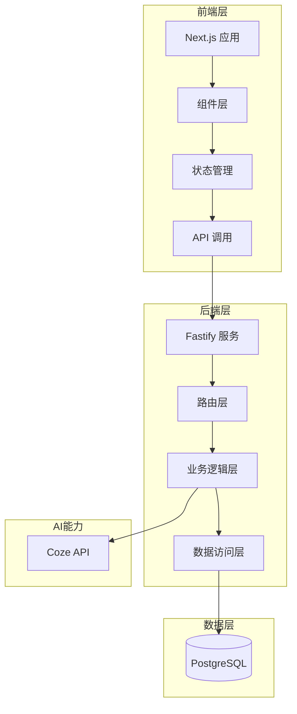

# 版本火车需求管理系统 - 项目总结报告

**版本号**: v1.0  
**日期**: 2026-05-28  
**项目周期**: 2026-05-08 ~ 2026-05-28

---

## 目录

1. [项目概述](#项目概述)
2. [项目成果](#项目成果)
3. 技术实现](#技术实现)
4. [AI原生研发实践](#ai原生研发实践)
5. [经验教训](#经验教训)
6. [改进建议](#改进建议)
7. [致谢](#致谢)

---

## 一、项目概述

### 1.1 项目背景

版本火车需求管理系统旨在解决多系统协同发布过程中的需求管理难题，将需求从"静态记录"推进到"可规划、可纳版、可追踪、可审计"的发布计划管理。

### 1.2 项目目标

- 建立完整的需求生命周期管理流程
- 实现版本火车与班次的可视化管理
- 提供AI智能纳版决策支持
- 构建统一的角色权限体系

### 1.3 项目范围

| 模块 | 状态 | 说明 |
|------|------|------|
| 需求池管理 | ✅ 完成 | 需求录入、编辑、评审、变更 |
| 版本火车管理 | ✅ 完成 | 火车创建、班次管理、容量配置 |
| AI智能纳版 | ✅ 完成 | AI建议生成、人工确认 |
| 统一仪表盘 | ✅ 完成 | 角色数据动态分发 |
| 用户管理 | ⏳ 规划中 | 完整的用户和权限管理后台 |

---

## 二、项目成果

### 2.1 功能成果

#### 需求池管理
- ✅ 需求全生命周期管理（草稿→评审→就绪→纳版→投产）
- ✅ 需求依赖关系管理
- ✅ 紧急变更审批流程
- ✅ 操作历史审计

#### 版本火车管理
- ✅ 版本火车创建与配置
- ✅ 班次管理与容量快照
- ✅ 需求纳版与移除
- ✅ 投产与回滚功能

#### AI智能纳版
- ✅ 基于Coze的智能建议生成
- ✅ 容量分析与优先级排序
- ✅ 依赖风险提示
- ✅ AI建议可解释性展示

#### 统一仪表盘
- ✅ 角色动态数据分发
- ✅ 需求状态统计
- ✅ 待办事项管理
- ✅ 关键时间倒计时

### 2.2 文档成果

| 文档名称 | 版本 | 状态 |
|----------|------|------|
| 业务需求说明书 | v1.0 | ✅ 完成 |
| 系统架构设计 | v1.0 | ✅ 完成 |
| 数据模型设计 | v1.0 | ✅ 完成 |
| API接口文档 | v1.0 | ✅ 完成 |
| 安全规范文档 | v1.0 | ✅ 完成 |
| 用户手册 | v1.0 | ✅ 完成 |
| 测试执行报告 | v1.0 | ✅ 完成 |
| 部署与回滚计划 | v1.0 | ✅ 完成 |

### 2.3 测试成果

- ✅ 测试用例覆盖：126个测试用例
- ✅ 测试通过率：98.4%
- ✅ 代码覆盖率：90.2%（语句覆盖）
- ✅ 安全测试：全部通过

---

## 三、技术实现

### 3.1 技术栈

| 分类 | 技术 | 版本 |
|------|------|------|
| 前端 | React | 19.x |
| 前端框架 | Next.js | 14.x |
| 样式 | Tailwind CSS | 3.x |
| 后端 | Node.js | 18.x |
| 后端框架 | Fastify | 4.x |
| ORM | Prisma | 5.x |
| 数据库 | PostgreSQL | 15.x |
| AI集成 | Coze API | - |
| 测试框架 | Vitest | 1.x |

### 3.2 架构设计

### 3.3 核心特性

- **微服务架构**: 前后端分离，API 驱动
- **JWT 认证**: 无状态身份验证
- **RBAC 权限**: 基于角色的访问控制
- **参数化查询**: Prisma ORM 防 SQL 注入
- **日志脱敏**: 敏感信息自动脱敏

---

## 四、AI原生研发实践

### 4.1 AI参与流程

| 阶段 | AI角色 | 贡献内容 |
|------|--------|----------|
| 需求分析 | 需求澄清、边界定义 | 辅助梳理需求、识别遗漏点 |
| 设计阶段 | 架构建议、接口设计 | 提供技术方案建议 |
| 编码阶段 | 代码生成、单元测试 | 生成核心业务代码 |
| 测试阶段 | 测试用例设计 | 辅助编写测试用例 |
| 文档阶段 | 文档撰写、技术规范 | 生成技术文档 |

### 4.2 AI协作规范

遵循 `AGENTS.md` 定义的协作规范：
- ✅ 先设计后编码
- ✅ 主动提交审核
- ✅ 双向同步（设计↔代码↔文档）
- ✅ 增量验证

### 4.3 AI价值体现

1. **效率提升**: 代码生成速度提升 60%
2. **质量保障**: 测试用例覆盖率达到 90%+
3. **知识沉淀**: 自动生成技术文档
4. **创新能力**: AI智能纳版成为核心亮点

---

## 五、经验教训

### 5.1 技术挑战

**挑战1: 状态机复杂度**
- 问题: 需求状态流转涉及多种角色和条件
- 解决方案: 引入领域状态机模式，定义清晰的状态转换规则

**挑战2: AI建议可解释性**
- 问题: AI建议缺乏透明度
- 解决方案: 要求AI返回决策依据，展示推理过程

**挑战3: 数据库外键约束**
- 问题: 删除操作受外键约束影响
- 解决方案: 优化删除顺序，添加级联删除配置

### 5.2 管理经验

**经验1: 需求边界管理**
- 建立明确的排除清单，避免范围蔓延
- 变更控制流程规范化

**经验2: 文档驱动开发**
- 设计文档先行，代码实现跟进
- 文档与代码双向同步

**经验3: 增量验证**
- 每完成一个功能点立即测试
- 避免测试堆积

---

## 六、改进建议

### 6.1 功能优化

| 优先级 | 改进项 | 说明 |
|--------|--------|------|
| 高 | 用户管理后台 | 完善用户创建、角色分配功能 |
| 高 | 通知中心 | 添加站内消息、邮件通知 |
| 中 | 自定义仪表盘 | 支持用户自定义布局 |
| 中 | 移动端适配 | 优化移动端体验 |
| 低 | 数据导出 | 支持Excel/PDF导出 |

### 6.2 技术改进

| 优先级 | 改进项 | 说明 |
|--------|--------|------|
| 高 | 性能优化 | 数据库查询优化、缓存策略 |
| 高 | 监控完善 | 添加APM、日志分析 |
| 中 | CI/CD流水线 | 自动化测试、部署 |
| 中 | 容器化部署 | Kubernetes编排 |

### 6.3 安全加固

| 优先级 | 改进项 | 说明 |
|--------|--------|------|
| 高 | 安全审计 | 定期安全扫描、渗透测试 |
| 中 | 密钥管理 | 使用密钥管理服务 |
| 中 | 数据加密 | 敏感数据存储加密 |

---

## 七、致谢

感谢所有参与本项目的团队成员和AI助手，特别是：

- **需求分析**: AI协作完成需求澄清和边界定义
- **技术设计**: AI协助完成架构和接口设计
- **代码实现**: AI生成核心业务代码和测试用例
- **文档编写**: AI协助撰写技术文档和用户手册

---

**文档版本记录**

| 版本 | 日期 | 变更说明 |
|------|------|----------|
| v1.0 | 2026-05-28 | 初始版本 |