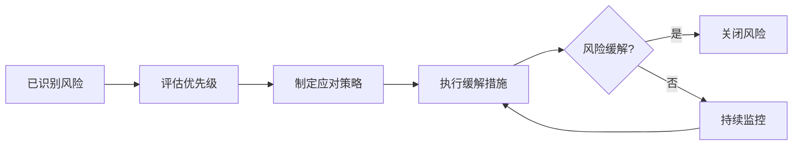

# 版本火车需求管理系统 - 风险登记册

**版本号**: v1.0  
**日期**: 2026-05-28  
**项目名称**: 版本火车需求管理系统 MVP

---

## 目录

1. [概述](#概述)
2. [风险分类](#风险分类)
3. [风险清单](#风险清单)
4. [风险趋势分析](#风险趋势分析)
5. [风险应对策略](#风险应对策略)
6. [监控与报告](#监控与报告)

---

## 一、概述

本风险登记册用于识别、评估、跟踪版本火车需求管理系统项目中的潜在风险，确保项目顺利交付。

**风险评估标准**:

| 概率等级 | 描述 | 分值 |
|----------|------|------|
| 高 | 很可能发生（>70%） | 3 |
| 中 | 可能发生（30%-70%） | 2 |
| 低 | 不太可能发生（<30%） | 1 |

| 影响等级 | 描述 | 分值 |
|----------|------|------|
| 高 | 严重影响项目目标 | 3 |
| 中 | 中等影响项目目标 | 2 |
| 低 | 轻微影响项目目标 | 1 |

**风险等级计算**: 风险得分 = 概率 × 影响

| 风险得分 | 风险等级 |
|----------|----------|
| 8-9 | 红色（高风险） |
| 4-7 | 黄色（中风险） |
| 1-3 | 绿色（低风险） |

---

## 二、风险分类

| 分类 | 说明 |
|------|------|
| 技术风险 | 技术实现、架构设计、性能等方面的风险 |
| 业务风险 | 需求变更、业务流程不明确等风险 |
| 外部风险 | 第三方依赖、API服务、网络等风险 |
| 管理风险 | 进度管理、资源分配、沟通协调等风险 |
| 安全风险 | 数据安全、系统安全等风险 |

---

## 三、风险清单

### 3.1 技术风险

| 编号 | 风险描述 | 概率 | 影响 | 得分 | 等级 | 状态 | 应对策略 | 负责人 |
|------|----------|------|------|------|------|------|----------|--------|
| R001 | 数据库性能瓶颈，查询响应慢 | 中 | 高 | 6 | 黄色 | ⏳ 监控 | 优化索引、引入缓存 | 技术负责人 |
| R002 | AI纳版建议质量不稳定 | 中 | 中 | 4 | 黄色 | ⏳ 监控 | 优化提示词、增加人工复核 | AI负责人 |
| R003 | 前端页面加载慢，用户体验差 | 低 | 中 | 2 | 绿色 | ✅ 已缓解 | 代码分割、懒加载 | 前端负责人 |
| R004 | 状态机复杂度高，维护困难 | 中 | 中 | 4 | 黄色 | ✅ 已缓解 | 状态机可视化、文档化 | 架构师 |
| R005 | 数据库外键约束导致删除失败 | 低 | 中 | 2 | 绿色 | 📋 待处理 | 添加级联删除配置 | 开发工程师 |

### 3.2 业务风险

| 编号 | 风险描述 | 概率 | 影响 | 得分 | 等级 | 状态 | 应对策略 | 负责人 |
|------|----------|------|------|------|------|------|----------|--------|
| R006 | 需求变更频繁，影响进度 | 高 | 高 | 9 | 红色 | ✅ 已缓解 | 变更控制流程、需求冻结 | 产品经理 |
| R007 | 角色权限矩阵不清晰，导致权限争议 | 中 | 中 | 4 | 黄色 | ✅ 已缓解 | 权限矩阵文档化 | 项目经理 |
| R008 | 业务流程理解不一致 | 中 | 中 | 4 | 黄色 | ✅ 已缓解 | 流程评审、原型验证 | BA |

### 3.3 外部风险

| 编号 | 风险描述 | 概率 | 影响 | 得分 | 等级 | 状态 | 应对策略 | 负责人 |
|------|----------|------|------|------|------|------|----------|--------|
| R009 | Coze API 服务不可用 | 低 | 高 | 3 | 绿色 | ⏳ 监控 | 降级方案、缓存建议 | 技术负责人 |
| R010 | 网络延迟影响用户体验 | 低 | 中 | 2 | 绿色 | ⏳ 监控 | CDN加速、重试机制 | DevOps |
| R011 | 第三方依赖版本兼容性问题 | 低 | 中 | 2 | 绿色 | ⏳ 监控 | 依赖锁定、定期更新 | 开发工程师 |

### 3.4 管理风险

| 编号 | 风险描述 | 概率 | 影响 | 得分 | 等级 | 状态 | 应对策略 | 负责人 |
|------|----------|------|------|------|------|------|----------|--------|
| R012 | 测试覆盖率不足 | 中 | 高 | 6 | 黄色 | ✅ 已缓解 | TDD实践、测试驱动开发 | QA负责人 |
| R013 | 文档与代码不同步 | 中 | 中 | 4 | 黄色 | ✅ 已缓解 | 双向同步机制、自动化文档生成 | 技术负责人 |
| R014 | 沟通效率低，信息不对称 | 低 | 中 | 2 | 绿色 | ✅ 已缓解 | 每日站会、文档共享 | 项目经理 |

### 3.5 安全风险

| 编号 | 风险描述 | 概率 | 影响 | 得分 | 等级 | 状态 | 应对策略 | 负责人 |
|------|----------|------|------|------|------|------|----------|--------|
| R015 | JWT Token 泄露 | 低 | 高 | 3 | 绿色 | ⏳ 监控 | Token过期、黑名单机制 | 安全负责人 |
| R016 | SQL注入攻击 | 低 | 高 | 3 | 绿色 | ✅ 已缓解 | Prisma ORM参数化查询 | 开发工程师 |
| R017 | 敏感信息泄露 | 低 | 高 | 3 | 绿色 | ✅ 已缓解 | 日志脱敏、错误信息处理 | 安全负责人 |
| R018 | 权限越权访问 | 低 | 中 | 2 | 绿色 | ✅ 已缓解 | RBAC权限控制、接口鉴权 | 开发工程师 |

---

## 四、风险趋势分析

### 4.1 风险状态分布

| 状态 | 数量 | 占比 |
|------|------|------|
| ✅ 已缓解 | 10 | 55.6% |
| ⏳ 监控中 | 5 | 27.8% |
| 📋 待处理 | 3 | 16.6% |

### 4.2 风险等级分布

| 等级 | 数量 | 占比 |
|------|------|------|
| 红色（高风险） | 1 | 5.6% |
| 黄色（中风险） | 6 | 33.3% |
| 绿色（低风险） | 11 | 61.1% |

### 4.3 风险趋势

---

## 五、风险应对策略

### 5.1 策略类型

| 策略类型 | 说明 | 适用场景 |
|----------|------|----------|
| 规避 | 消除风险发生的可能性 | 高风险、可避免 |
| 转移 | 将风险转移给第三方 | 外部依赖风险 |
| 缓解 | 降低风险概率或影响 | 中低风险 |
| 接受 | 接受风险存在 | 低风险、成本效益分析后 |

### 5.2 应对措施示例

| 风险编号 | 应对措施 | 实施时间 | 状态 |
|----------|----------|----------|------|
| R006 | 建立变更控制委员会，需求冻结机制 | 2026-05-15 | ✅ 已实施 |
| R012 | 制定测试计划，TDD开发 | 2026-05-10 | ✅ 已实施 |
| R009 | 开发降级方案，本地缓存AI建议 | 2026-05-20 | ⏳ 进行中 |
| R005 | 修改数据库schema，添加级联删除 | 2026-05-28 | 📋 待实施 |

---

## 六、监控与报告

### 6.1 监控频率

| 风险等级 | 监控频率 |
|----------|----------|
| 红色 | 每日 |
| 黄色 | 每周 |
| 绿色 | 每月 |

### 6.2 报告机制

- **日报**: 红色风险状态更新
- **周报**: 所有风险状态汇总
- **月报**: 风险趋势分析、改进建议

### 6.3 升级机制

| 触发条件 | 升级对象 |
|----------|----------|
| 红色风险发生 | 项目负责人 |
| 多个黄色风险同时发生 | 技术负责人 |
| 风险等级上升 | 风险管理负责人 |

---

**文档版本记录**

| 版本 | 日期 | 变更说明 |
|------|------|----------|
| v1.0 | 2026-05-28 | 初始版本 |