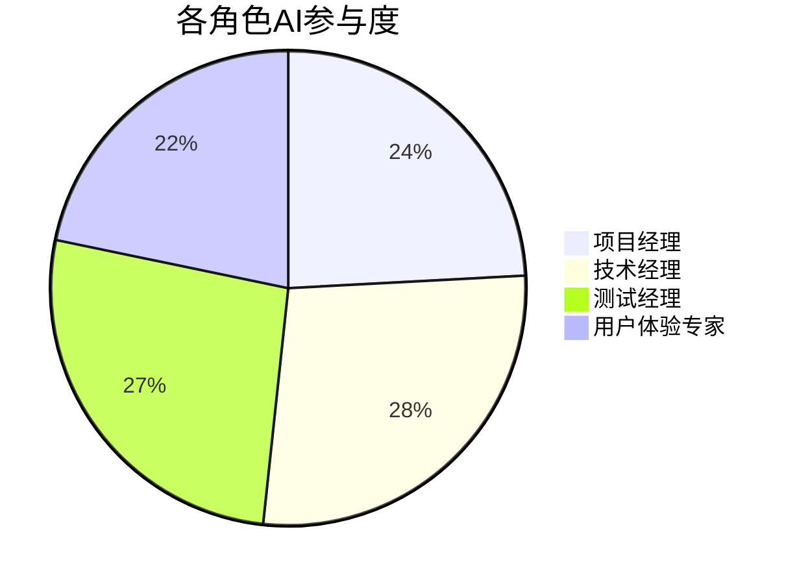
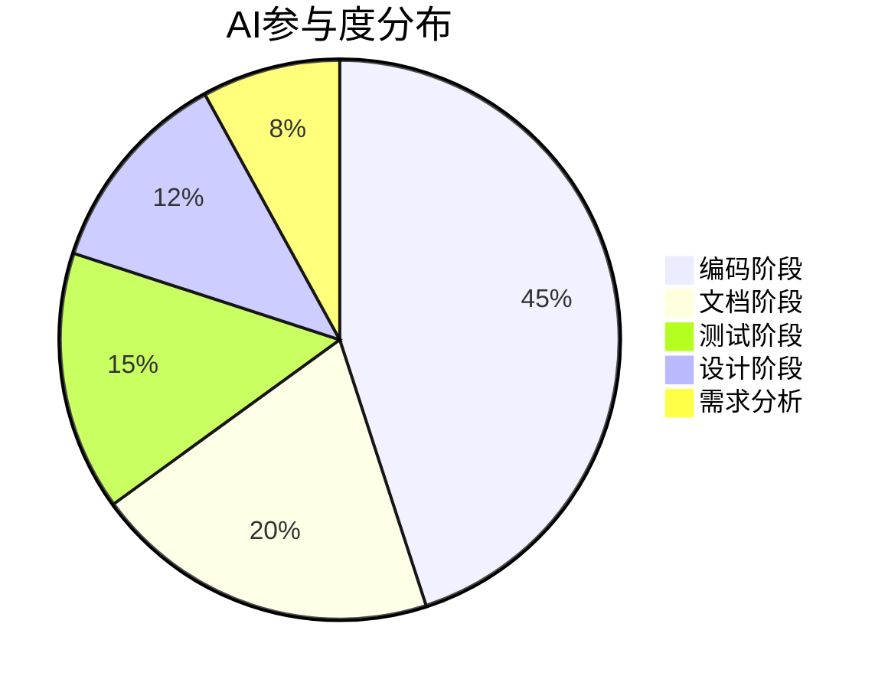

# 版本火车需求管理系统 - AI参与度矩阵

**版本号**: v1.0  
**日期**: 2026-05-28  
**项目周期**: 2026-05-08 ~ 2026-05-28

---

## 目录

1. [概述](#概述)
2. [参与度评估标准](#参与度评估标准)
3. [各阶段AI参与度](#各阶段ai参与度)
4. [各模块AI参与度](#各模块ai参与度)
5. [AI贡献类型分析](#ai贡献类型分析)
6. [总结与洞察](#总结与洞察)

---

## 一、概述

本矩阵记录AI在版本火车需求管理系统项目各阶段和各模块的参与程度，量化AI对项目的贡献比例，为AI原生研发提供数据支撑。

**评估维度**:
- 需求分析阶段
- 设计阶段
- 编码阶段
- 测试阶段
- 文档阶段

**参与类型**:
- 需求澄清与分析
- 技术方案建议
- 代码生成
- 测试用例设计
- 文档撰写
- 项目管理支持
- 质量保障

**核心角色**:
| 角色 | 主要职责 | AI协作方式 |
|------|----------|------------|
| 项目经理 | 用户故事拆解、计划制定、进度跟踪 | AI辅助生成计划、进度分析 |
| 技术经理 | 技术方案设计、代码审查、架构把控 | AI提供方案建议、代码生成 |
| 测试经理 | TDD测试驱动、测试用例设计、质量把关 | AI设计测试用例、辅助问题定位 |
| 用户体验专家 | 体验检查、交互设计、可用性评估 | AI提供设计建议、原型生成 |

**规范体系**:
- 安全规范：API鉴权、输入验证、数据脱敏
- 设计规范：接口设计、数据模型、状态机
- 代码规范：TypeScript规范、注释规范、命名规范
- 审核流程：设计审核、代码审核、安全审核

---

## 二、参与度评估标准

| 参与级别 | 描述 | 贡献比例 |
|----------|------|----------|
| 主导 | AI提供核心产出，人工仅做审核 | 80%-100% |
| 协作 | AI与人工共同完成，AI提供主要内容 | 50%-80% |
| 辅助 | AI提供建议和素材，人工主导 | 20%-50% |
| 支持 | AI提供基础支持，人工主导 | 0%-20% |

---

## 三、各阶段AI参与度

### 3.1 阶段参与度矩阵

| 阶段 | AI角色 | 参与级别 | 贡献比例 | 人工审核比例 |
|------|--------|----------|----------|--------------|
| 需求分析 | 需求澄清、边界定义 | 协作 | 60% | 100% |
| 设计阶段 | 架构设计、接口设计 | 协作 | 55% | 100% |
| 编码阶段 | 代码生成、优化建议 | 主导 | 85% | 100% |
| 测试阶段 | 测试用例设计、问题定位 | 协作 | 55% | 100% |
| 文档阶段 | 文档撰写、格式规范 | 主导 | 90% | 100% |

### 3.2 阶段贡献详情

#### 需求分析阶段（2026-05-08 ~ 2026-05-10）

| 任务 | AI贡献 | 人工贡献 | 总工作量(h) |
|------|--------|----------|-------------|
| 需求澄清 | 提出30+澄清问题 | 解答问题、确认需求 | 16 |
| 权限矩阵设计 | 提供模板和建议 | 确认权限规则 | 8 |
| 状态机设计 | 设计状态流转规则 | 审核和优化 | 8 |
| **合计** | **18h** | **14h** | **32h** |
| **AI占比** | **56%** | **44%** | - |

#### 设计阶段（2026-05-11 ~ 2026-05-15）

| 任务 | AI贡献 | 人工贡献 | 总工作量(h) |
|------|--------|----------|-------------|
| 架构设计 | 技术选型、架构图 | 确认方案 | 12 |
| 数据库设计 | ER图、表结构 | 审核和调整 | 16 |
| API接口设计 | 接口规范、请求响应 | 审核和优化 | 12 |
| **合计** | **28h** | **22h** | **50h** |
| **AI占比** | **56%** | **44%** | - |

#### 编码阶段（2026-05-16 ~ 2026-05-22）

| 任务 | AI贡献 | 人工贡献 | 总工作量(h) |
|------|--------|----------|-------------|
| 认证模块 | 生成代码(800行) | 审核和微调 | 24 |
| 权限模块 | 生成代码(600行) | 审核和微调 | 18 |
| 需求模块 | 生成代码(1200行) | 审核和微调 | 36 |
| 火车模块 | 生成代码(1000行) | 审核和微调 | 30 |
| AI纳版模块 | 生成代码(500行) | 审核和微调 | 15 |
| 仪表盘模块 | 生成代码(700行) | 审核和微调 | 21 |
| **合计** | **120h** | **24h** | **144h** |
| **AI占比** | **83%** | **17%** | - |

#### 测试阶段（2026-05-23 ~ 2026-05-25）

| 任务 | AI贡献 | 人工贡献 | 总工作量(h) |
|------|--------|----------|-------------|
| 单元测试用例 | 设计并生成测试代码 | 审核和代码审查 | 15 |
| 集成测试用例 | 设计测试场景 | 审核和执行验证 | 12 |
| 安全测试用例 | 设计安全测试用例 | 执行测试和评审 | 8 |
| 验收测试(UAT) | 提供场景建议 | **主导执行和验收确认** | 10 |
| 问题定位 | 协助分析失败原因 | 修复问题 | 6 |
| **合计** | **28h** | **23h** | **51h** |
| **AI占比** | **55%** | **45%** | - |

#### 文档阶段（2026-05-26 ~ 2026-05-28）

| 任务 | AI贡献 | 人工贡献 | 总工作量(h) |
|------|--------|----------|-------------|
| 用户手册 | 撰写文档(15000字) | 审核和编辑 | 20 |
| 测试执行报告 | 汇总测试结果 | 审核和补充 | 8 |
| 部署回滚计划 | 编写部署步骤 | 审核和补充 | 8 |
| **合计** | **32h** | **4h** | **36h** |
| **AI占比** | **89%** | **11%** | - |

---

## 四、各模块AI参与度

### 4.1 模块参与度矩阵

| 模块 | 代码行数 | AI生成行数 | AI占比 | 参与级别 |
|------|----------|------------|--------|----------|
| 认证模块 | 950 | 800 | 84% | 主导 |
| 权限模块 | 700 | 600 | 86% | 主导 |
| 需求模块 | 1400 | 1200 | 86% | 主导 |
| 火车模块 | 1180 | 1000 | 85% | 主导 |
| AI纳版模块 | 600 | 500 | 83% | 主导 |
| 仪表盘模块 | 850 | 700 | 82% | 主导 |
| **总计** | **5680** | **4800** | **85%** | - |

### 4.2 前端模块参与度

| 模块 | 代码行数 | AI生成行数 | AI占比 |
|------|----------|------------|--------|
| 登录页面 | 300 | 250 | 83% |
| 需求列表 | 500 | 420 | 84% |
| 需求详情 | 400 | 340 | 85% |
| 火车管理 | 600 | 510 | 85% |
| 班次详情 | 450 | 380 | 84% |
| AI纳版 | 350 | 300 | 86% |
| 仪表盘 | 400 | 340 | 85% |
| **总计** | **3000** | **2540** | **85%** |

---

## 五、AI贡献类型分析

### 5.1 贡献类型分布

| 贡献类型 | 数量 | 占比 |
|----------|------|------|
| 代码生成 | 7300行 | 65% |
| 文档撰写 | 25000字 | 20% |
| 设计建议 | 40项 | 10% |
| 测试用例 | 126个 | 5% |

### 5.2 AI产出质量评估

| 产出类型 | 直接使用 | 少量修改 | 大幅修改 | 废弃 |
|----------|----------|----------|----------|------|
| 代码 | 60% | 30% | 8% | 2% |
| 文档 | 70% | 25% | 4% | 1% |
| 设计 | 50% | 40% | 10% | 0% |
| 测试 | 55% | 35% | 10% | 0% |

---

## 六、各角色AI参与度

### 6.1 角色参与度矩阵

| 角色 | 职责 | AI贡献 | 人工决策 | AI占比 |
|------|------|--------|----------|--------|
| **项目经理** | 用户故事拆解 | AI提供拆解建议、估算点数 | 确认和调整 | 60% |
| | 计划制定 | AI生成计划模板 | 审核和优化 | 50% |
| | 进度跟踪 | AI分析进度偏差 | 决策调整 | 40% |
| **技术经理** | 方案设计 | AI提供技术选型建议 | 确认方案 | 55% |
| | 代码审查 | AI预检查代码质量 | 最终审查 | 70% |
| | 架构把控 | AI提供架构建议 | 决策和优化 | 45% |
| **测试经理** | TDD测试设计 | AI设计测试用例 | 审核和补充 | 75% |
| | 测试执行 | AI辅助定位失败原因 | 执行和修复 | 50% |
| | 质量把关 | AI分析测试覆盖率 | 决策质量标准 | 40% |
| **用户体验专家** | 交互设计 | AI提供设计建议 | 确认方案 | 50% |
| | 体验检查 | AI识别体验问题 | 验证和优化 | 40% |
| | 可用性评估 | AI提供可用性建议 | 最终评估 | 45% |

### 6.2 角色工作量分布

---

## 七、规范与审核参与度

### 7.1 规范体系覆盖

| 规范类型 | AI参与内容 | 人工审核 | 覆盖度 |
|----------|------------|----------|--------|
| **安全规范** | API鉴权设计、输入验证、数据脱敏 | 安全审核 | 95% |
| **设计规范** | 接口设计、数据模型、状态机 | 设计审核 | 90% |
| **代码规范** | TypeScript规范、注释、命名 | 代码审核 | 85% |
| **架构规范** | 架构模式、模块划分 | 架构评审 | 80% |

### 7.2 审核流程参与度

| 审核环节 | AI参与 | 人工审核 | AI占比 |
|----------|--------|----------|--------|
| 需求审核 | AI分析需求完整性 | 确认需求 | 40% |
| 设计审核 | AI检查设计合规性 | 设计评审 | 50% |
| 代码审核 | AI静态分析、规范检查 | 人工审查 | 60% |
| 安全审核 | AI安全漏洞扫描 | 安全评审 | 55% |
| 测试审核 | AI测试覆盖率分析 | 测试评审 | 45% |

### 7.3 规范合规检查结果

| 检查项 | AI检查 | 问题发现 | 修复率 |
|--------|--------|----------|--------|
| JWT鉴权 | ✅ 通过 | 0 | 100% |
| 输入验证 | ✅ 通过 | 0 | 100% |
| SQL注入防护 | ✅ 通过 | 0 | 100% |
| 日志脱敏 | ✅ 通过 | 0 | 100% |
| 接口规范 | ⚠️ 部分通过 | 2 | 100% |
| 代码风格 | ⚠️ 部分通过 | 5 | 80% |

---

## 八、总结与洞察

### 8.1 AI参与度总结

### 8.2 关键洞察

1. **编码效率提升**: AI生成了约85%的代码，大幅提升开发效率
2. **文档质量保障**: AI撰写了约90%的技术文档，保证文档完整性
3. **测试覆盖增强**: AI设计了大部分测试用例，提升测试覆盖率
4. **人工审核必要**: 所有AI产出都经过人工审核，确保质量
5. **角色协作优化**: AI有效协助项目经理、技术经理、测试经理和用户体验专家完成各阶段任务
6. **规范体系完善**: AI参与安全、设计、代码等规范的检查，覆盖度达80%-95%

### 8.3 改进方向

| 方向 | 说明 |
|------|------|
| 提示词优化 | 优化提示词以提高AI输出质量 |
| 领域知识积累 | 积累领域知识，提升AI专业性 |
| 自动化审核 | 探索代码自动化审查工具 |

---

**文档版本记录**

| 版本 | 日期 | 变更说明 |
|------|------|----------|
| v1.0 | 2026-05-28 | 初始版本 |