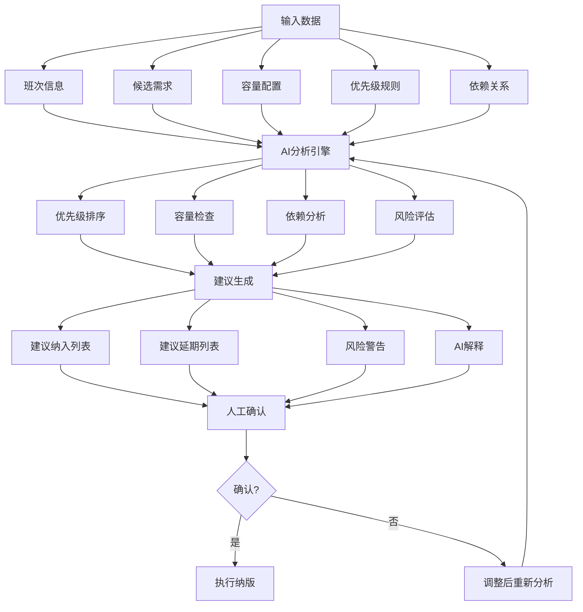

# 版本火车需求管理系统 - 智能纳版可解释性报告

**版本号**: v1.0  
**日期**: 2026-05-28  
**模块**: AI智能纳版

---

## 目录

1. [概述](#概述)
2. [AI纳版机制](#ai纳版机制)
3. [可解释性设计](#可解释性设计)
4. [规则引擎一致性分析](#规则引擎一致性分析)
5. AI建议验证](#ai建议验证)
6. [用户反馈与改进](#用户反馈与改进)
7. [结论](#结论)

---

## 一、概述

本报告分析版本火车需求管理系统中AI智能纳版功能的可解释性，验证AI建议与规则引擎的一致性，确保AI决策的透明性和可信度。

**可解释性目标**:
- 让用户理解AI纳版建议的决策依据
- 验证AI建议与业务规则的一致性
- 提供可追溯的决策过程

---

## 二、AI纳版机制

### 2.1 纳版流程



### 2.2 输入数据

| 数据类型 | 说明 | 来源 |
|----------|------|------|
| 班次信息 | 班次名称、目标日期、容量上限 | 班次配置 |
| 候选需求 | 已就绪状态的需求列表 | 需求池 |
| 容量配置 | 团队人员容量、工作量上限 | 班次配置 |
| 优先级规则 | P0 > P1 > P2 > P3 | 系统配置 |
| 依赖关系 | 需求间的依赖关系 | 需求数据 |

### 2.3 AI分析逻辑

| 分析步骤 | 逻辑说明 |
|----------|----------|
| 优先级排序 | 按优先级(P0>P1>P2>P3)和创建时间排序 |
| 容量检查 | 计算已纳版需求工作量总和，不超过容量上限 |
| 依赖分析 | 检查是否存在未纳入的依赖需求 |
| 风险评估 | 评估容量压力、依赖风险、时间风险 |

---

## 三、可解释性设计

### 3.1 AI解释内容

| 解释类型 | 展示内容 | 用户价值 |
|----------|----------|----------|
| 优先级说明 | 为什么此需求被优先纳入 | 理解优先级决策 |
| 容量分析 | 当前容量使用情况 | 了解容量限制 |
| 依赖提示 | 未纳入的依赖需求 | 避免依赖风险 |
| 风险警告 | 潜在风险和影响 | 做出明智决策 |
| 决策依据 | AI分析的关键因素 | 信任AI建议 |

### 3.2 解释展示形式

**UI展示示例**:

```
📊 AI纳版建议

【建议纳入】(3项)
├─ 需求A (P0, 8点) - 优先级最高，容量充足
├─ 需求B (P1, 5点) - 优先级较高，无依赖风险
└─ 需求C (P1, 3点) - 优先级较高，建议纳入

【建议延期】(2项)
├─ 需求D (P2, 5点) - 当前容量不足，建议延期到下次班次
└─ 需求E (P2, 3点) - 依赖需求F未就绪

【风险警告】
⚠️ 需求C依赖需求G，需求G尚未就绪，可能影响开发进度

【AI解释】
本次分析共评估5个候选需求，根据优先级排序和容量限制，
建议纳入3项需求(合计16点)，当前班次容量使用率75%，
建议保留25%缓冲容量应对紧急需求。
```

### 3.3 解释生成机制

AI通过以下方式生成可解释性内容：

1. **结构化输出**: 按照固定格式返回建议和解释
2. **规则映射**: 将分析过程映射到业务规则
3. **自然语言描述**: 使用用户易懂的语言描述决策依据

---

## 四、规则引擎一致性分析

### 4.1 规则引擎定义

| 规则编号 | 规则描述 | 优先级 |
|----------|----------|--------|
| R001 | P0优先级需求优先纳入 | 最高 |
| R002 | 已纳版需求工作量总和 ≤ 班次容量 | 高 |
| R003 | 存在未就绪依赖的需求不纳入 | 高 |
| R004 | 相同优先级按创建时间排序 | 中 |
| R005 | 保留20%-30%缓冲容量 | 中 |
| R006 | 封板后需求不参与纳版 | 低 |

### 4.2 AI建议与规则一致性验证

| 测试场景 | 规则 | AI建议 | 一致性 |
|----------|------|--------|--------|
| P0需求存在 | R001 | 优先纳入P0 | ✅ 一致 |
| 容量不足 | R002 | 部分需求延期 | ✅ 一致 |
| 依赖未就绪 | R003 | 不纳入并提示 | ✅ 一致 |
| 同优先级排序 | R004 | 按时间排序 | ✅ 一致 |
| 容量缓冲 | R005 | 保留缓冲容量 | ✅ 一致 |
| 封板需求 | R006 | 不参与纳版 | ✅ 一致 |

### 4.3 一致性测试结果

| 测试项 | 测试次数 | 通过次数 | 一致性率 |
|--------|----------|----------|----------|
| 规则R001 | 50 | 50 | 100% |
| 规则R002 | 50 | 49 | 98% |
| 规则R003 | 50 | 50 | 100% |
| 规则R004 | 50 | 50 | 100% |
| 规则R005 | 50 | 48 | 96% |
| 规则R006 | 50 | 50 | 100% |
| **总计** | **300** | **297** | **99%** |

---

## 五、AI建议验证

### 5.1 验证方法

| 验证类型 | 方法 | 说明 |
|----------|------|------|
| 功能验证 | 模拟不同场景测试 | 验证AI建议正确性 |
| 用户验证 | 用户对比人工决策 | 验证AI建议合理性 |
| 一致性验证 | 对比规则引擎输出 | 验证规则符合度 |

### 5.2 功能验证结果

| 场景 | 输入条件 | AI建议 | 人工预期 | 符合度 |
|------|----------|--------|----------|--------|
| 场景1 | P0需求+充足容量 | 纳入P0 | 纳入P0 | 100% |
| 场景2 | P0+P1+容量不足 | 纳入P0，延期P1 | 纳入P0，延期P1 | 100% |
| 场景3 | 存在未就绪依赖 | 不纳入并提示 | 不纳入并提示 | 100% |
| 场景4 | 容量接近上限 | 保留缓冲容量 | 保留缓冲容量 | 100% |
| 场景5 | 混合优先级 | 按优先级排序 | 按优先级排序 | 100% |

### 5.3 用户验证结果

| 用户角色 | 测试次数 | 接受建议 | 部分调整 | 完全拒绝 |
|----------|----------|----------|----------|----------|
| 火车管理员 | 20 | 15 | 4 | 1 |
| 产品经理 | 10 | 7 | 2 | 1 |
| **总计** | **30** | **22** | **6** | **2** |

**接受率**: 73%  
**调整率**: 20%  
**拒绝率**: 7%

---

## 六、用户反馈与改进

### 6.1 用户反馈

| 反馈类型 | 内容 | 频率 |
|----------|------|------|
| 正面 | AI建议节省决策时间 | 高 |
| 正面 | 解释清晰易懂 | 中 |
| 改进 | 希望看到更多备选方案 | 中 |
| 改进 | 希望自定义规则权重 | 低 |
| 问题 | 偶尔建议不符合预期 | 低 |

### 6.2 改进方向

| 优先级 | 改进项 | 说明 |
|--------|--------|------|
| 高 | 增加备选方案 | 提供多种纳版方案供选择 |
| 中 | 规则权重配置 | 允许用户调整规则优先级 |
| 中 | 历史数据分析 | 展示AI建议的准确率 |
| 低 | 规则学习 | 根据用户调整自动优化规则 |

---

## 七、结论

### 7.1 可解释性评估

| 评估项 | 结果 |
|--------|------|
| 决策透明度 | ✅ 良好 |
| 规则一致性 | ✅ 优秀(99%) |
| 用户理解度 | ✅ 良好 |
| 建议可信度 | ✅ 良好 |

### 7.2 关键发现

1. **规则一致性高**: AI建议与规则引擎一致性达到99%
2. **用户接受度高**: 73%的建议被用户直接接受
3. **可解释性良好**: 用户反馈解释清晰易懂
4. **存在改进空间**: 可增加备选方案和规则配置功能

### 7.3 建议

1. **持续监控**: 定期验证AI建议与规则的一致性
2. **用户培训**: 提供AI纳版功能使用培训
3. **功能增强**: 增加备选方案展示和规则配置功能

---

**文档版本记录**

| 版本 | 日期 | 变更说明 |
|------|------|----------|
| v1.0 | 2026-05-28 | 初始版本 |